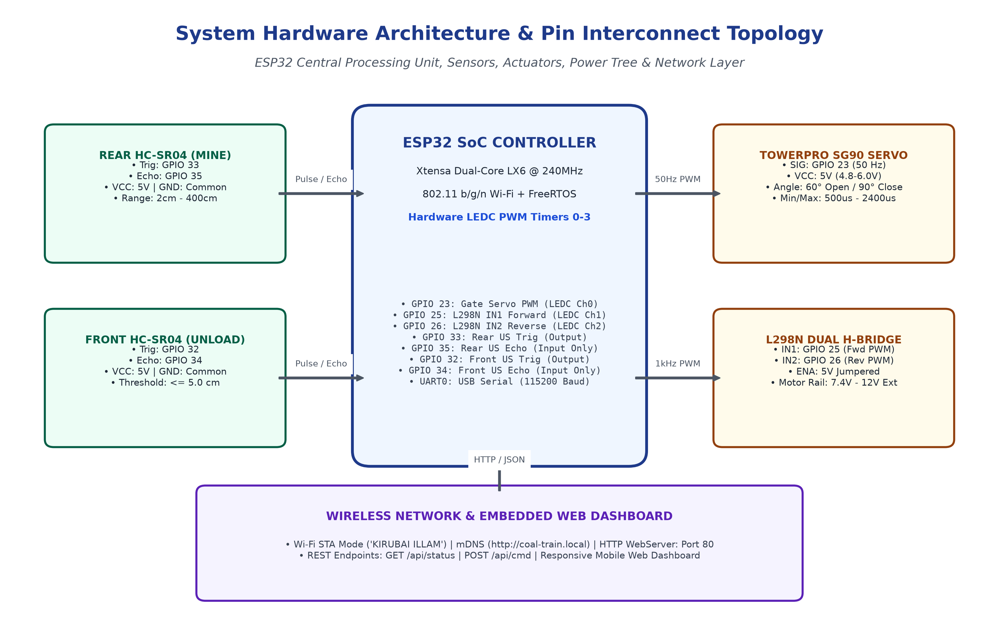
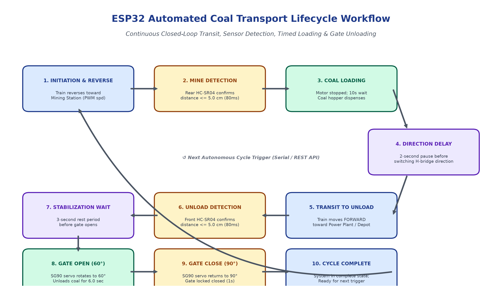
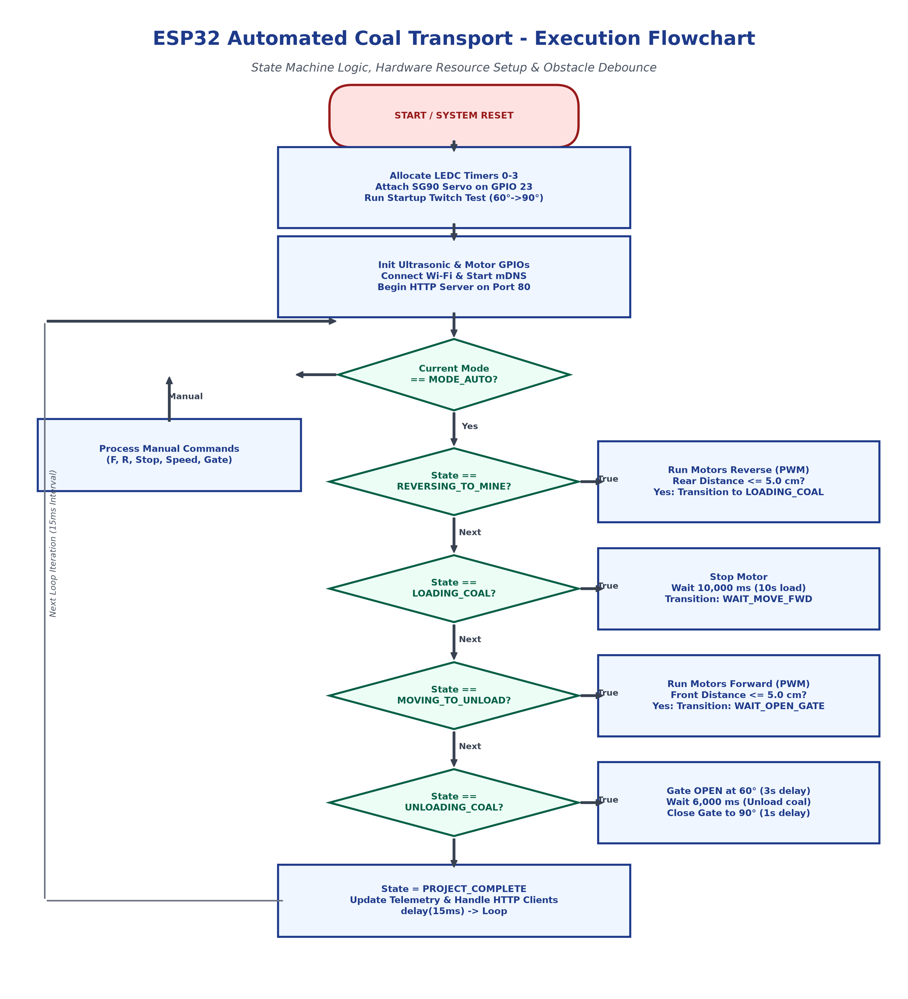

# Automated Coal Transport Train System 🚂⚡

[](https://www.espressif.com/)
[](https://www.arduino.cc/)
[](https://opensource.org/licenses/MIT)

An industrial IoT-enabled autonomous coal transport railway system powered by an **ESP32 dual-core microcontroller**. Features closed-loop autonomous transit, ultrasonic obstacle/docking sensing, servo-actuated coal hopper gating, and a real-time mobile-friendly web dashboard with embedded RESTful API control.

---

## 📌 System Highlights

- **Autonomous Closed-Loop Transit**: Deterministic 12-state Finite State Machine (FSM) governing coal loading, transit, obstacle verification, gate unloading, and reset.
- **Precision Docking & Safety**: Dual HC-SR04 ultrasonic sensors (Mining pit & Unloading terminal) with 80 ms debounce filtering (detection threshold: $\le 5.0\text{ cm}$).
- **Motor Control & PWM**: L298N Dual H-Bridge motor driver modulated with 8-bit PWM speed control (70–255 duty cycle) to prevent DC motor stalling under load.
- **Gate Actuation**: TowerPro SG90 micro-servo running on dedicated 50 Hz PWM (LEDC Channel 0) for smooth, non-jamming 60° (Open) and 90° (Closed) gating.
- **Embedded Web Dashboard & Telemetry**: Built-in HTTP server on Port 80 and mDNS responder (`http://coal-train.local`) streaming live telemetry, position modeling, and REST commands.
- **Dual-Mode Operation**: Automatic cycle execution or manual remote control (Forward, Reverse, Stop, Speed Adjustment, Gate Test).

---

## 🏗️ Hardware Architecture & Pin Interconnect



### Pin Mapping Table

| Component | Pin | ESP32 GPIO | Function / Notes |
| :--- | :--- | :--- | :--- |
| **SG90 Servo** | Signal (Orange) | **GPIO 23** | 50 Hz Hardware PWM (LEDC Channel 0) |
| | VCC (Red) | **5V / VIN** | 4.8V – 6.0V DC (Do NOT use 3.3V) |
| | GND (Brown) | **GND** | Shared common ground |
| **Rear HC-SR04 (Mine)** | TRIG | **GPIO 33** | Digital Output (10 µs trigger pulse) |
| | ECHO | **GPIO 35** | Input-only GPIO (Pulse measurement) |
| | VCC / GND | **5V / GND** | 5V supply rail |
| **Front HC-SR04 (Unload)** | TRIG | **GPIO 32** | Digital Output (10 µs trigger pulse) |
| | ECHO | **GPIO 34** | Input-only GPIO (Pulse measurement) |
| | VCC / GND | **5V / GND** | 5V supply rail |
| **L298N Motor Driver** | IN1 | **GPIO 25** | Forward direction PWM (LEDC Channel 1) |
| | IN2 | **GPIO 26** | Reverse direction PWM (LEDC Channel 2) |
| | ENA / ENB | Jumpered 5V | Motor speed modulated via IN1/IN2 |
| | GND | **GND** | **Must connect to ESP32 GND** |
| | 12V Terminal | Battery (+) | External power supply (7.4V – 12V DC) |

---

## 🔄 Operational Workflow & Lifecycle



1. **Initiation**: Train begins reversing toward the Mining Pit at configured PWM speed.
2. **Mine Docking**: Rear ultrasonic sensor confirms obstacle $\le 5.0\text{ cm}$ for $\ge 80\text{ ms}$.
3. **Coal Loading**: Train halts for 10.0 seconds while overhead hopper dispenses simulated coal.
4. **Direction Delay**: 2.0-second stabilization pause prevents back-EMF inrush current.
5. **Transit to Unload**: Train accelerates forward along the railway toward the power station depot.
6. **Unload Docking**: Front ultrasonic sensor detects unloading barrier $\le 5.0\text{ cm}$.
7. **Stabilization**: 3.0-second delay settles railcar momentum.
8. **Discharge (Open Gate)**: SG90 servo opens to 60° for 6.0 seconds to release coal.
9. **Lock Gate**: SG90 servo returns to 90° closed position (1.0 second settling).
10. **Cycle Complete**: Train enters complete status, standing ready for the next cycle.

---

## ⚙️ Algorithmic Flowchart



---

## 🌐 REST API Endpoints

The embedded web server serves a responsive dashboard on `http://<ESP32_IP>/` or `http://coal-train.local/`.

| Endpoint | Method | Parameters | Description |
| :--- | :--- | :--- | :--- |
| `/api/status` | `GET` | None | Returns JSON telemetry (mode, state, distances, IR flags, speed, servo angle, Wi-Fi RSSI) |
| `/api/cmd` | `POST / GET` | `action=start_auto` | Starts the autonomous coal cycle |
| `/api/cmd` | `POST / GET` | `action=load_and_run` | Triggers coal loading then runs forward to unload |
| `/api/cmd` | `POST / GET` | `action=pause_toggle` | Toggles pause/resume state without losing timer progress |
| `/api/cmd` | `POST / GET` | `action=stop` | Emergency stop (halts all motor PWM immediately) |
| `/api/cmd` | `POST / GET` | `action=forward` / `reverse` | Manual directional jogging |
| `/api/cmd` | `POST / GET` | `action=gate_open` / `gate_close` | Sets servo to 60° (Open) or 90° (Closed) |
| `/api/cmd` | `POST / GET` | `action=gate_test` | Runs diagnostic sweep (`0° -> 60° -> 90° -> 120° -> 90°`) |
| `/api/cmd` | `POST / GET` | `action=set_speed&percent=X` | Sets motor PWM speed (0–100%) |

---

## ⌨️ Serial Terminal Commands (115200 Baud)

Connect via USB Serial Monitor to execute real-time diagnostics:

- `F` / `R` / `S`: Move Forward / Reverse / Stop
- `O` / `C` / `T`: Open Gate (60°) / Close Gate (90°) / Test Sweep
- `A`: Start Autonomous Cycle
- `L`: Load Coal & Run
- `P` / `Space`: Toggle Pause / Resume
- `-` / `+`: Decrease / Increase Speed (10% step)
- `1` – `4`: Speed Presets (40%, 60%, 80%, 100%)
- `D`: Print Instant Sensor Diagnostics

---

## 📄 Project Documentation

A comprehensive technical report with formal state machine definitions, electrical specifications, and performance analysis is available in the repository:
- 📑 [`ESP32_Automated_Coal_Transport_System_Technical_Report.docx`](ESP32_Automated_Coal_Transport_System_Technical_Report.docx)

---

## 🚀 Getting Started

1. Open `ESP32_WiFi_Control.ino` in **Arduino IDE** (or VS Code + PlatformIO).
2. Install required libraries via Library Manager:
   - `ESP32Servo` (v3.2.1+)
   - `ArduinoJson` (v7.x)
   - `WebServer`, `WiFi`, `ESPmDNS` (built into ESP32 core)
3. Select board: **ESP32 Dev Module**.
4. Configure your Wi-Fi SSID and password:
   ```cpp
   const char* ssid = "YOUR_WIFI_SSID";
   const char* password = "YOUR_WIFI_PASSWORD";
   ```
5. Upload the code and open the Serial Monitor at `115200 baud`.
6. Access the dashboard at the IP address printed on the Serial Monitor or navigate to `http://coal-train.local/`.
